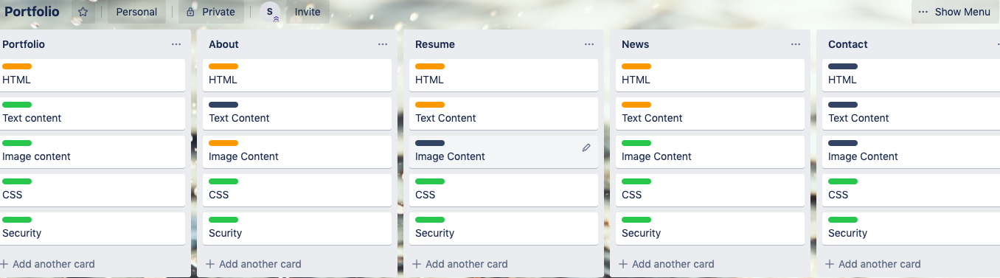

# Sarah A's Portflio

In one week I created a basic portfolio consisting of five HMTL pages and styled respectively. One of the three versions created has been hosted on Github and can be accessed via srahooa.github.io. Additionally, my repo pertaining to this project is can be accesssed via https://github.com/srahooa/portfolio. There are three branches- master, version2, and version3 within the "portfolio" repo

### Purpose: 
This portfolio was created to present a professional face to potential employers. In addition to sharing my resume and technical skills, this page gives perspective to my personality and soft skills. It demonstrates my ability to create cohesive pages and to use unique styling on various components. As my first webpage created in HTML/CSS, it will also serve as a benchmark by which to measure my learning and growth.

### Functionality / features:
The five pages are the 'landing page' (index.html), 'about me' which shares soft skills and personality (about.html), 'resume' which highlights technical skill set and past work experience (resume.html), 'news & blog' which is more of a blog page (news.html), and finally a 'contact me' page complete with a contact form. The links for each page can be accessed via a hamburger menu in the upper left corner, or via the footer at the bottom of the page. I have included the following components: a hamburger navigation bar, various text layouts/fonts/stylings, a form, footer links, a link to a pdf, radial images, image transitions from b&w to color, scaled transitions on social media links, and styling of button for access to PDF. The pages are responisve from mobile to desktop.

### Sitemap
The site visitor lands on the welcome page. From there using the hamburger menu or the fotter links, they can access the other four pages. Only 'resume.html' and 'contact.html' have further links- pdf link, or a contact me form. Additionally in the footer, a visitor can access my social media links- twitter, linkedin, and github. 

https://github.com/srahooa/portfolio/blob/version3/ppt/sitemap.jpg

### Screenshots
Planning my layouts and color scheme: 

https://github.com/srahooa/portfolio/blob/master/src/docs/moodboards.png

Tracking tasks on Trello:

https://github.com/srahooa/portfolio/blob/master/src/docs/trello-workprogress.png

Wireframes in the manner I am most comfortable with: 

https://github.com/srahooa/portfolio/blob/version3/ppt/wf-desktop.jpg

https://github.com/srahooa/portfolio/blob/version3/ppt/wf-mobile.jpg

For additional screenshots, see here:

https://github.com/srahooa/portfolio/blob/version3/ppt/PORTFOLIO.pdf

### Target audience
The target audience for this page would be those in the tech industry and potential employers. As mentioned previously, it is a demonstration of my skill and my growth as a developer. Specifically, I would present this to anyone interested in my abilities with HTML, CSS, Sass, and Git. I choose to host it on GitHub as this is my preliminary site that I hope to improve in the weeks to come. As I improve the site and materials, I look forward to paying to host it externally.  

### Tech Stack
This project was built strictly on HTML and CSS. The end product was hosted on GitHub. 

